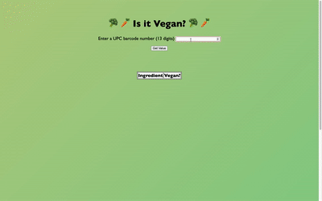

 
<h5 align="center">With a background in psychology, I am looking to bring my knowledge of learning processes and motivation to a team of dedicated, likeminded engineers.</h5>

<!--
  
-->

🔭 I’m currently working on **a social networking site for book lovers to connect with others who share the same passion for reading. You can view all of my projects on my [website](kailakelly.netlify.app)**.

👨‍💻 I’m currently learning **JavaScript and Node.js**

📫 How to reach me **kailakelly0@gmail.com**

 <h3 align="center">Connect with me:</h3>

 

<h3 align="center">Languages and Tools:</h3>

      

 

<h2 align="center">Projects</h2>

<table>
 <tr>
  
  <td width="50%" valign="top">
   <h3 align="center">Ayesha Hair Salon</h3>
    
   
    

<strong>HTMl & CSS</strong> - Display client's salon services and lookbook

  </td>
  
  <td width="50%" valign="top">
   <h3 align="center">Morning Fresh Restaurant</h3>
    
   
    

<strong>HTMl & CSS</strong> - Display client's salon services and lookbook

  </td>
  
 </tr>
 
 <tr>
  <td width="50%" valign="top">
   <h3 align="center">Vegan Food Checker</h3>
    
  
    

<strong>HTMl, CSS, JavaScript</strong> - Application to check whether prepackaged food products contain vegan ingredients

  </td>
  
<td width="50%" valign="top">
   <h3 align="center">KailaKelly.com</h3>
    
  
    

<strong>HTMl, CSS, JavaScript</strong> - Portfolio website displaying my projects and contact information

  </td>
  
 </tr>
 
 </table>

 

